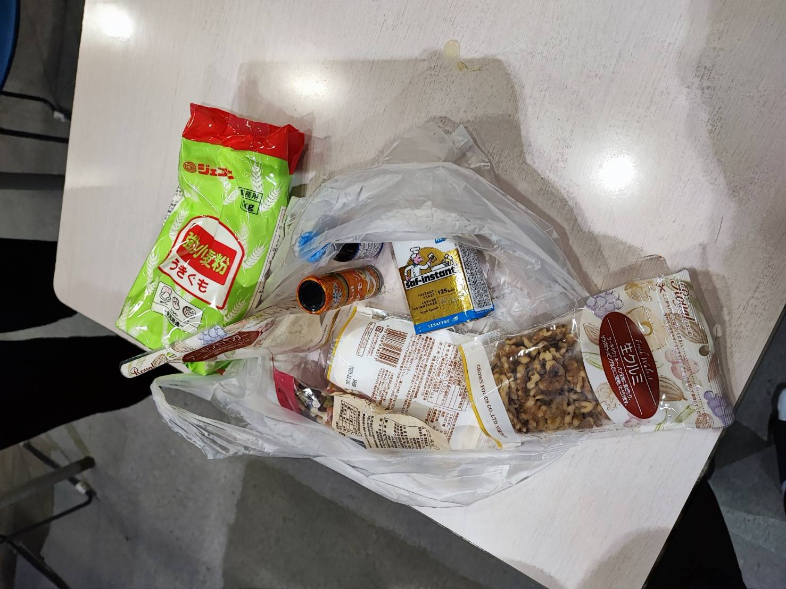
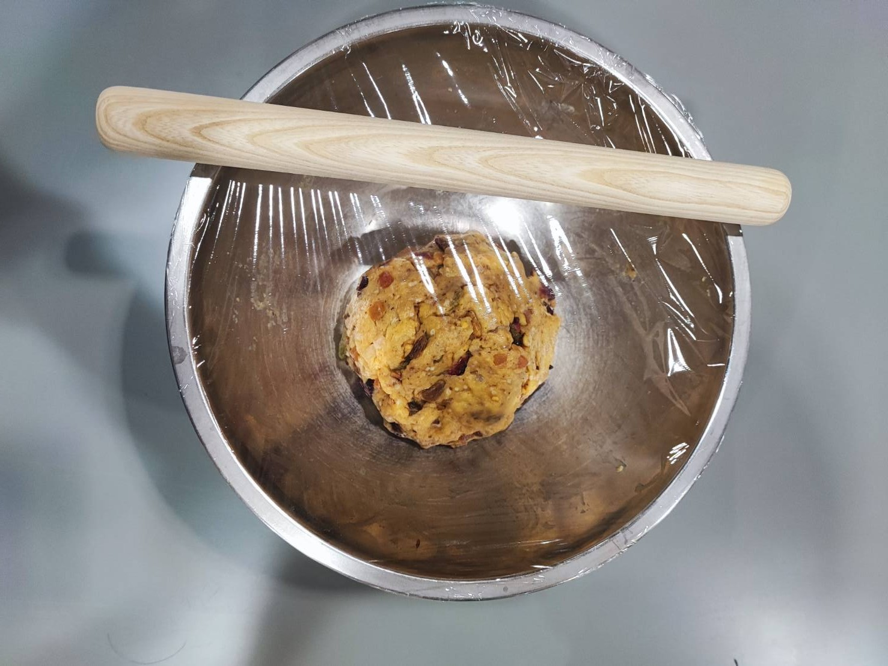
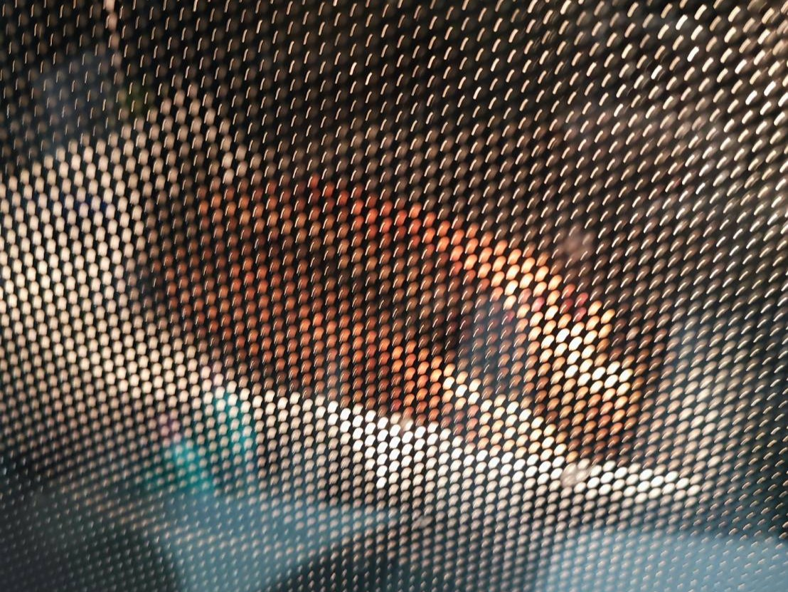
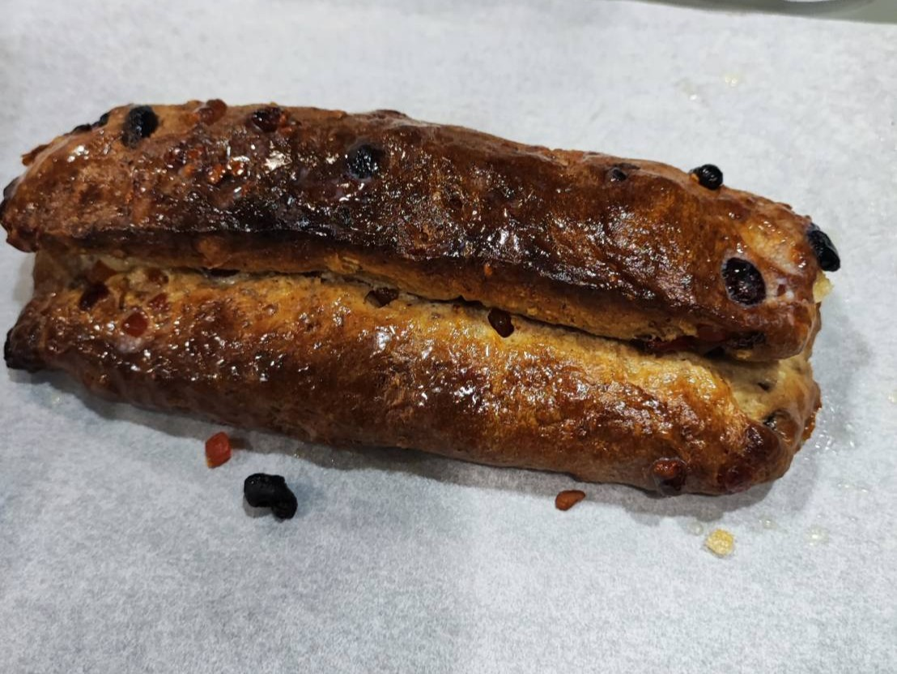
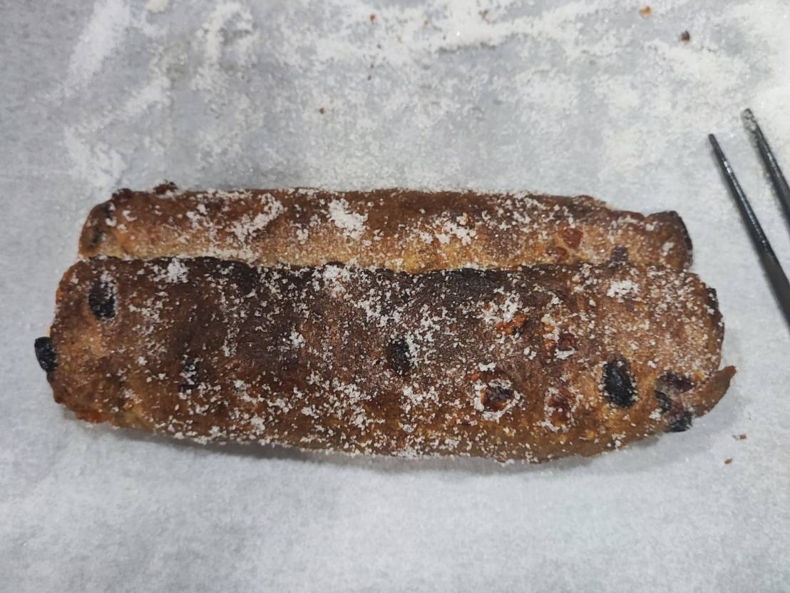
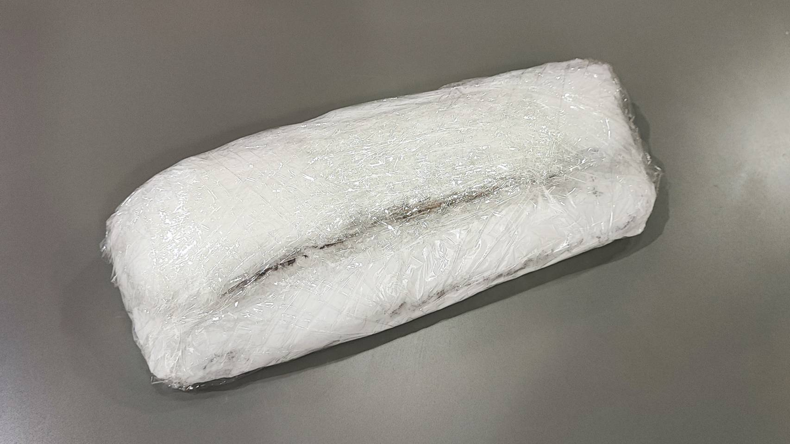
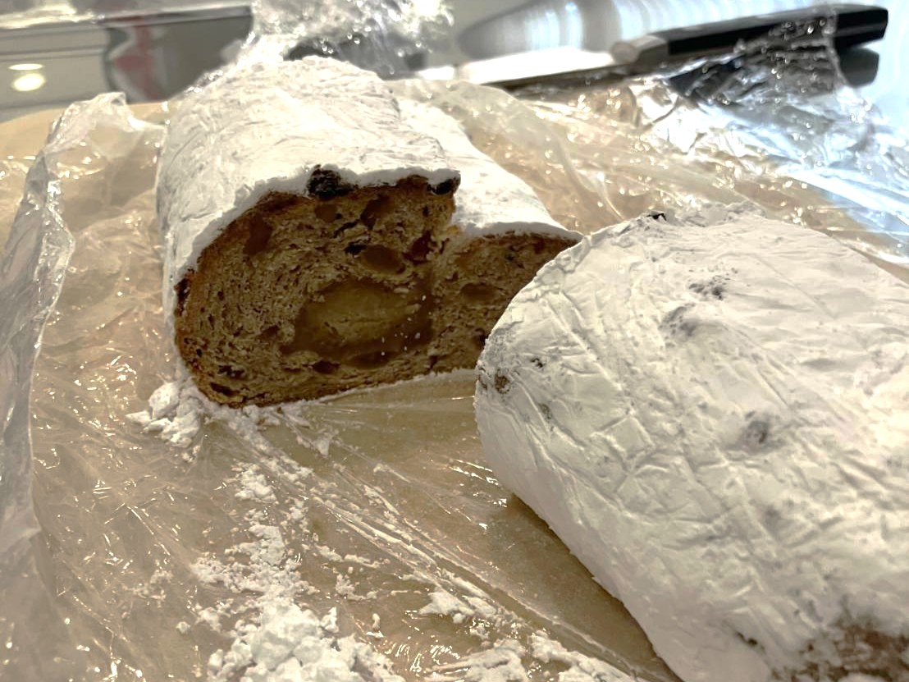

<iframe src="https://adventar.org/calendars/10770/embed" width="620" height="362" frameborder="0" loading="lazy"></iframe>

>この記事は[MMA Advent Calendar 2024 - Adventar](https://adventar.org/calendars/10770) の24日目の記事です。

## はじめに

こんにちは、MMAに所属している幽霊部員のkofeです。

昨日はnamorさんの[Google Timeline の代替探しの旅](https://namorz.com/blog/2024/location/)でした。

自分の移動した場所を後で見返したりすると面白いですよね。私もGoogleMapのタイムラインきのうで見返してみました。ずっと寮と大学を行き来しているだけでした。。。社畜。。。

今回はクリスマスということで、ちょっと遅い気もしますが、おいしいシュトーレンの作り方を紹介します。もう間に合わないって方は来年のクリスマスにどうぞ。

## シュトーレンって何ぞや

シュトーレンとは、ドイツのクリスマスに食べられる洋酒につけられたフルーツやナッツが入った伝統的な真っ白いパンです。アドベントの時期に食べられることが多いらしいです。ドイツ語の神教授が去年言っていたのを思い出して作ることにしました。

## 材料

* 強力粉
* 牛乳
* 卵
* 無塩バター
* シュガーパウダー
* アーモンドパウダー
* クルミ
* フルーツ砂糖漬け
* ラムエッセンス
* インスタントイースト(サフ金がおすすめ、糖度が高いと発酵しづらいらしく耐糖性のものを使用)
* シナモン

買ってきた材料たち(3000円。。。)

## 作り方

今回はPROFOODSさんの[簡単！本格シュトーレンのレシピ・作り方](https://www.profoods.co.jp/feature-stollen)を参考にしました。

### 0. 準備
* フルーツ砂糖漬けをラムエッセンスに漬けておく(ラムエッセンスは適量、というかラム酒で戻すべき)
* クルミを粉々にする
* クルミ、アーモンドパウダーをフライパンで煎る
* 溶かしたバター、牛乳、卵黄を混ぜる(卵白はとっておこう)

### 1. 生地を作る
1. 強力粉、塩、アーモンドパウダー、シュガーパウダー、インスタントイースト、シナモンを混ぜる
2. 1に準備で混ぜておいたバターなどを加えて混ぜる
3. 粉っぽくなくなったらラム酒で戻したフルーツ、クルミを加えて混ぜる
4. ひとまとめにしてラップで包んで常温で1時間発酵させる
:::tip
冬は少し暖かいところがいいかも
:::

### 2. マジパンを作る
1. アーモンドパウダー、シュガーパウダー、卵白を混ぜる
2. 粉っぽくなくなるまで頑張って混ぜる
3. 20㎝くらいの棒状にしてラップで包んで冷蔵庫でおく

### 3. 成形する
1. 生地を22×20cmくらいに伸ばして両端を折りたたむ
2. マジパンを真ん中に置いて生地で包み、形を整える
:::tip
少しずらして包むとそれっぽくなる
:::
:::tip
ここで端の部分をしっかりくっつけないと焼いて膨らんだ時に半開きになるので注意
:::

### 4. ヤキを入れる
1. 170℃に予熱したオーブンで40分焼く(仕上げ用のバターを湯せんで溶かしておく)
:::tip
焼き目が先についてしまったらアルミホイルを上に乗せるといいらしい
:::

2. 焼きあがってすぐに溶かしておいたバターを塗る(全面に)
:::tip
底が焼けてたら生やけじゃないらしい\
焼けてなかったらこの工程のあと一日ほど休ませて、温度を少し下げてもっかい焼くのもあり\
(何度も重ねて焼くレシピもある)
:::

3. グラニュー糖を全体にまぶす

4.生地を完全に冷まし、シュガーパウダーをかけたラップの上に置き、たくさんシュガーパウダーをかける

### 5. 食べごろ
2,3日寝かせるとうまいです。中央から食べる分をそれぞれ1cm幅にスライスしてアドベントの時期に毎日食べましょう。

## おわりに
今回はシュトーレンの作り方をご紹介しました。画面の目の前のそこのあなた🫵今から作りましょう！

ついに明日はクリスマスですね。皆さんどんなクリスマスを過ごすのでしょうか。私は製図の予定が入っています。~~彼女~~ 製図セットと過ごす製夜は忘れられないものになりそうです。

最後の締めはUdonさんの記事です。お楽しみに！

## おまけ
私は今学生寮に住んでおり、その行事の一環で寮生とこのシュトーレンを作ったのですが、なんと食べようとした日にインフルにかかってしまい現在隔離中です。反応が気になったけど残念…まあきっとうまいと思ってもらえたでしょう。多分。